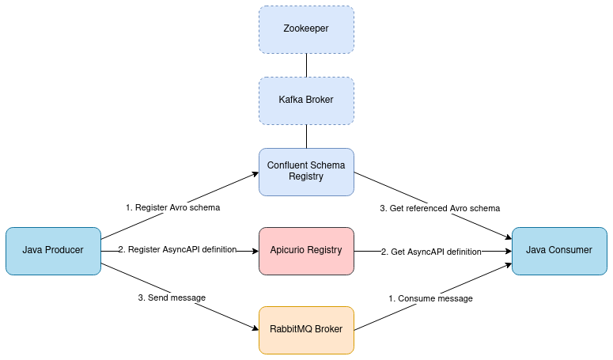

:toc:
:toc-title:
:toclevels: 2
:sectnums:
= Showcase: Apicurio & AsyncAPI

== Motivation
The https://www.openapis.org/[OpenAPI] specification for describing REST interfaces in a standardized way has already established itself in many project and application areas. While OpenAPI has become established for synchronous interfaces, asynchronous communication places new demands on the interface definition. For this reason, https://www.asyncapi.com/[AsyncAPI] provides an extension to the OpenAPI definition to meet these new requirements.
https://www.asyncapi.com/blog/openapi-vs-asyncapi-burning-questions[This blog article] highlights the differences between OpenAPI and AsyncAPI in more detail.

A common scenario in larger projects involves multiple teams working and developing together. Nevertheless, there should be no dependencies between the teams. A central factor for this is that the documentation of the interfaces for the microserverices and components is available to all teams in an uncomplicated manner. For this reason, it seems to be a reasonable use case to store API definitions in a registry as a central point of access.
https://www.apicur.io/registry/[Apicurio Registry] is intended to enable this for various specifications, e.g. OpenAPI, AsyncAPI, GraphQL, Apache Avro, Protobuf, JSON Schema and others.

This showcase will look at how AsyncAPI and Apicurio can be used. Nevertheless, the development of AsyncAPI and Apicurio is progressing rapidly and new features are added regularly. For this reason, this showcase is only a snapshot that may become outdated after a short period of time.

== Architecture
In a https://github.com/NovatecConsulting/tc-showcase-rabbitmq[previous showcase], the interoperability of AMQP 0.9.1 and AMQP 1.0 was investigated. Since this can only be guaranteed to a limited extent, this project should additionally investigate whether it is possible to produce and consume messages in Avro format through a RabbitMQ broker.

Since this project was originally developed in the direction of an https://solace.com/what-is-an-event-mesh/[event mesh], the use of different brokers can be considered realistic. One possible scenario would involve a https://kafka.apache.org/documentation/[Kafka broker] already being present in the system and existing applications obtaining their https://avro.apache.org/[Avro schemas] from a Confluent Schema Registry. Later, a https://www.rabbitmq.com/[RabbitMQ broker] could be added to the system. In order to provide the AsyncAPI definitions centrally, Apicurio can be used at this point.

== Requirements
As already partially visible in the diagram above, the Producer and Consumer applications should fulfill the following:

1. An AsyncAPI definition is provided which references an Avro schema. The definition used in this project can be found at src/main/resources/asyncapi.json.

2. The AsyncAPI definition is registered at Apicurio. The Avro schema is registered at Confluent Schema Registry.

3. Clients can pull the specifications from Apicurio and resolve the reference to the Avro schema.

4. Generation of messages and/or validation against the schemas is possible.

== Evaluation

=== Schema Registry Registration & Access
Avro schemas can be registered at Schema Registry using the Schema Registry library by Confluent. A topic/subject name needs to be provided for each new schema. Alternatively, it is also possible to use the SpecificAvroSerializer for schema registration. The schema will be registered automatically when an object is serialized and the class/schema it belongs to is not already present.

=== Apicurio Registry Registration & Access
Apicurio also provides a library to access and manage the artifacts located at the registry. For each artifact, a unique
ID is required for identification. +

=== AsyncAPI and Apicurio Registry
Apicurio puts an emphasis on OpenAPI support, which can be seen from the fact that Apicurio Studio was developed for OpenAPI. Apicurio Registry supports several formats, including AsyncAPI. Nevertheless, not all specification details of AsyncAPI are supported yet, which is also due to the fast development of AsyncAPI.

A central element of AsyncAPI are the external references, which can be used in almost every AsyncAPI element. This makes it possible to move the definition of components to another place in the document or outside the document. External remote references are also explicitly supported.

Thus, theoretically, https://github.com/asyncapi/playground/issues/30#issuecomment-681865570[external references to an Avro schema can also be defined], which can be used to format the payload of a message. Currently, it is possible to define external references when using Apicurio, but these are not automatically resolved by Apicurio Registry. As a result, only the link to the external schema is displayed in the registry, which can leave important information about the message payload unknown to the user.

In contrast, the AsyncAPI Playground, for example, can resolve external references and display them (depending on the format of the reference). A similar representation would be desirable for Apicurio Registry, as is also https://github.com/Apicurio/apicurio-registry/issues/865[planned for the future].

=== Data Models Library
The https://github.com/Apicurio/apicurio-data-models[data models library] by Apicurio adds functionalities for the usage of OpenAPI and AsynAPI
specifications in Java clients. It is possible to create a new specification and to read from existing documents. +
If the API specification contains a schema definition (e.g., Avro), validation against this schema is *not* available. Schema validation then has to be handled by custom client implementations.

As mentioned above, resolving external references is not fully supported at the moment. However, the data models library offers the possibility to implement the interface https://github.com/Apicurio/apicurio-data-models/blob/master/src/main/java/io/apicurio/datamodels/core/util/IReferenceResolver.java[_IReferenceResolver_] in order to be able to integrate external schemas. +
The default implementation can in principle already resolve external references (as documented https://github.com/Apicurio/apicurio-data-models/blob/master/src/main/java/io/apicurio/datamodels/core/util/IReferenceResolver.java[here] and https://github.com/Apicurio/apicurio-data-models/blob/master/src/main/java/io/apicurio/datamodels/openapi/visitors/dereference/Dereferencer.java[here]), but not at such a deep level as allowed by the AsyncAPI specification. The https://www.asyncapi.com/docs/specifications/v2.1.0#messageObject[AsyncAPI specification] allows that the payload object in the message object also represents an external reference.

However, the data models library only checks objects for external references if the https://github.com/Apicurio/apicurio-data-models/blob/master/src/main/java/io/apicurio/datamodels/openapi/visitors/dereference/Dereferencer.java[implement the IReferenceNode interface]. While the https://github.com/Apicurio/apicurio-data-models/blob/master/src/main/java/io/apicurio/datamodels/asyncapi/models/AaiMessageBase.java[message object] implements this interface, the https://github.com/Apicurio/apicurio-data-models/blob/master/src/main/java/io/apicurio/datamodels/asyncapi/models/AaiMessage.java[payload object] in the data models library is only of type "Object". The payload object is therefore not checked for external references, so they remain unresolved.

=== Message Exchange
The scenario shown in the diagram in section 2 can in principle be implemented using Apicurio, Schema Registry and RabbitMQ. However, some custom implementations are required to resolve the externally referenced Avro schema. This makes the implementation more complicated than necessary.

However, this is only true if the external reference is supposed to be inserted into the AsyncAPI definition. If the API definition does not contain external references and has a simpler structure or resolution is not necessary, this problem does not even occur.

Additional information, such as the broker URL and port may be relevant for application development. These could be obtained via the AsyncAPI definition, similar to the definition of environment variables. The Data Models Library could be used for this purpose. However, the library did not seem to be suitable for this, as the AsyncAPI document must be traversed to access the required properties.

=== Further AsyncAPI Features
*Modelina* +
At the time of implementing this showcase, the https://github.com/asyncapi/modelina[Modelina tool] was not yet actively promoted by AsyncAPI. In the meantime, information about it can also be found on https://www.asyncapi.com/modelina[AsyncAPI's website].

With Modelina, data models can be generated from AsyncAPI definitions, as it is already possible for Avro models. The tool could therefore have been used in this showcase. A further evaluation and tests still have to be done.

*Avro Schema Parser* +
The https://github.com/asyncapi/avro-schema-parser[Avro Schema Parser] Tool allows to resolve Avro schemas in the payload of messages (as would be desirable for Apicurio and explained in Section 4.4). Unfortunately, it looks like this tool is only available for JavaScript and no other programming language.

== Conclusion
Apicurio can currently be used for AsyncAPI definitions with a few special restrictions. Nevertheless, AsyncAPI is still in a dynamic development and is getting more and more popularity. It is expected that with widespread use of AsyncAPI, some features will be added for use with Apicurio.

At the same time, the AsyncAPI team is currently developing https://github.com/asyncapi/studio[AsyncAPI Studio]. According to the documentation, Studio will be similar to Apicurio Studio, which focuses on the use with OpenAPI.

== Further Ideas and Outlook
The team of AsyncAPI has some interesting ideas on the roadmap. Some of them are:

- https://github.com/asyncapi/glee[Glee]: An AsyncAPI framework.
- https://github.com/asyncapi/event-gateway[Event Gateway]: An event gateway to validate, manipulate, aggregate and filter messages.
- https://github.com/asyncapi/cli[CLI Tool]: To validate AsyncAPI definitions. New features are planned.
- https://github.com/asyncapi/simulator[Simulator]: To simulate application scenarios. In an early stage of development.
- https://github.com/asyncapi/cupid[Cupid]: Analyzes relationships between AsyncAPI documents and outputs a map of the system architecture.

